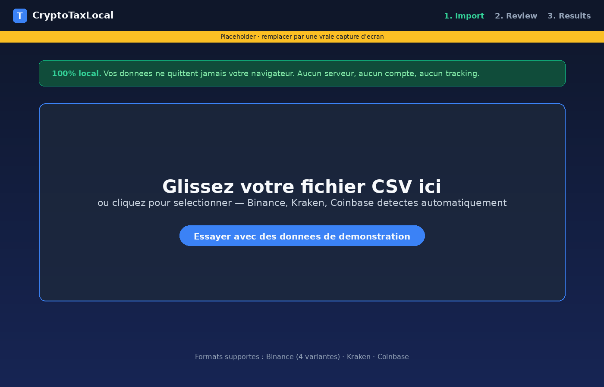
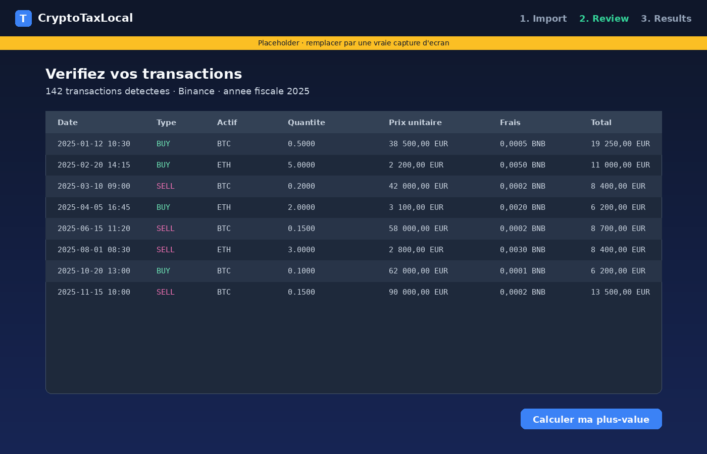
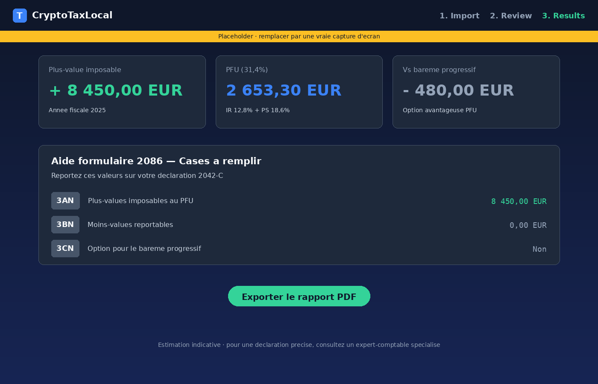

<div align="right">

:gb: English | **[:fr: Francais](README.fr.md)**

</div>

<div align="center">


# CryptoTaxLocal

**The free, open-source, local-first crypto tax calculator for France.**

No account. No upload. No tracking. Your CSV stays on your machine.

[](LICENSE)
[](https://www.typescriptlang.org/)
[](https://react.dev/)
[](https://vite.dev/)
[](#tech-stack)
[](CONTRIBUTING.md)

### [→ Try it online](https://cryptotaxlocal.com)

[Report a bug](https://github.com/Emeric-FullStack/cryptotaxlocal/issues) · [Contribute](CONTRIBUTING.md) · [Roadmap](https://github.com/Emeric-FullStack/cryptotaxlocal/issues?q=is%3Aissue+is%3Aopen+label%3Aroadmap)

</div>

---

<div align="center">

> **Tax season 2026 is open** — Updated rates (PFU 31.4%), form 2086, 305 EUR exemption threshold, DAC8 info.

</div>

---

## Why CryptoTaxLocal?

Existing tools like Koinly or Waltio require you to **create an account**, **upload your transactions** to their servers, and **pay** for a tax report. For sensitive financial data, that shouldn't be necessary.

CryptoTaxLocal runs **entirely in your browser**. Nothing ever leaves your machine.

<table>
<tr><th></th><th>CryptoTaxLocal</th><th>Koinly</th><th>Waltio</th></tr>
<tr><td><strong>Price</strong></td><td>Free</td><td>$49 - $199/yr</td><td>39 - 999 EUR/yr</td></tr>
<tr><td><strong>Account required</strong></td><td>No</td><td>Yes</td><td>Yes</td></tr>
<tr><td><strong>Data on server</strong></td><td>No (100% local)</td><td>Yes (cloud)</td><td>Yes (cloud)</td></tr>
<tr><td><strong>Open source</strong></td><td>Yes (MIT)</td><td>No</td><td>No</td></tr>
<tr><td><strong>Free PDF export</strong></td><td>Yes</td><td>No (paid)</td><td>No (paid)</td></tr>
<tr><td><strong>Offline (PWA)</strong></td><td>Yes</td><td>No</td><td>No</td></tr>
</table>

## Screenshots

<table>
<tr>
<td width="33%" align="center">



**1. Import**
Drag & drop your CSV — exchange auto-detected.

</td>
<td width="33%" align="center">



**2. Review**
Check your transactions, edit unit prices.

</td>
<td width="33%" align="center">



**3. Results**
Exact breakdown + form 2086 helper + PDF.

</td>
</tr>
</table>

> These are representative placeholders. Real product screenshots coming soon — PRs welcome!

## Features

<table>
<tr>
<td width="50%">

**Import & Calculation**
- CSV import with auto-detection (4 Binance formats, Kraken, Coinbase, Revolut)
- French formula Article 150 VH bis (global PA, not simple FIFO)
- Historical prices via Binance API (unlimited) + CoinGecko fallback
- Fee deduction from proceeds (exchange + gas fees)

</td>
<td width="50%">

**French Tax Rules (2026)**
- Flat tax 31.4% or progressive scale (toggle)
- 305 EUR exemption threshold
- PDF tax report with fees, unit prices, sources
- Form 2086 helper (boxes 3AN / 3BN / 3CN)

</td>
</tr>
<tr>
<td>

**Privacy & Transparency**
- Zero server, zero tracking
- 100% client-side processing
- Open source & auditable
- Verifiable commit hash in footer
- PWA: works offline

</td>
<td>

**Content & UX**
- Editable unit prices per transaction
- Tooltips explaining every calculation
- Freshness alerts (outdated build, tax rules change)
- Dark mode

</td>
</tr>
</table>

## Quick Start

```bash
git clone https://github.com/Emeric-FullStack/cryptotaxlocal.git
cd cryptotaxlocal
npm install
npm run dev
```

Open `http://localhost:5173`, drag your CSV file, done.

> **No CSV handy?** Click "Essayer avec des donnees de demonstration" in the app to try with demo data.

## Tax Rates (April 2026)

| Component | Rate | Source |
|:---|:---:|:---|
| Income tax (IR) | 12.8% | Art. 200 A CGI |
| CSG | 10.6% | PLFSS 2026 |
| CRDS | 0.5% | |
| Solidarity levy | 7.5% | |
| **Total flat tax (PFU)** | **31.4%** | |

<details>
<summary><strong>Details & edge cases</strong></summary>

- **Exemption threshold:** If your total annual disposals are under 305 EUR, gains are tax-free.
- **Progressive tax option:** You can opt for the progressive income tax scale (box 3CN) if more favorable.
- **Crypto-to-crypto swaps:** Non-taxable until June 30, 2026. Taxable from July 1, 2026 (ordinance 2024-936).
- **DAC8:** Since January 1, 2026, crypto platforms report transaction data to EU tax authorities.

</details>

## Supported Exchanges

| Exchange | Format | Status |
|:---|:---|:---:|
| Binance | CSV Trade History | :white_check_mark: |
| Kraken | CSV Trades | :white_check_mark: |
| Coinbase | CSV Transaction History | :white_check_mark: |
| Revolut | CSV Crypto Transactions | :white_check_mark: (beta) |
| KuCoin | — | :construction: Planned |
| Bybit | — | :construction: Planned |
| Bitpanda | — | :construction: Planned |

> Using an unsupported exchange? [Open a parser request](https://github.com/Emeric-FullStack/cryptotaxlocal/issues/new?template=exchange_request.yml) or [contribute one yourself](CONTRIBUTING.md#adding-an-exchange-parser-the-most-wanted-contribution) — most parsers take less than 2 hours to write.

## Tech Stack

```
Frontend     React 19 + TypeScript + Vite
Styling      Tailwind CSS v4
PDF          jsPDF + jspdf-autotable
Parsing      PapaParse
Prices       Binance public API (primary) + CoinGecko (fallback)
Hosting      Cloudflare Pages
Backend      None
Database     None
Cost/month   $0
```

## Architecture

```
src/
├── components/
│   ├── ImportStep.tsx          # Drag & drop CSV + auto-detection
│   ├── ReviewStep.tsx          # Transaction review
│   ├── ResultsStep.tsx         # Results + tax breakdown
│   ├── legal/                  # Legal pages (FR: mentions, RGPD, CGU)
│   └── pages/                  # SEO content pages
├── engine/
│   ├── parsers/
│   │   ├── binance.ts          # Binance CSV parser
│   │   ├── kraken.ts           # Kraken CSV parser
│   │   ├── coinbase.ts         # Coinbase CSV parser
│   │   └── index.ts            # Auto-detection & dispatch
│   ├── calculator/
│   │   └── fifo.ts             # French formula (Art. 150 VH bis) + tax summary
│   ├── prices/
│   │   ├── binance-api.ts      # Binance public klines API (no limit)
│   │   ├── coingecko.ts        # CoinGecko fallback (365-day limit)
│   │   └── index.ts            # Multi-source price service
│   ├── tax-rules/
│   │   └── france.ts           # French tax rules (rates, thresholds, brackets)
│   └── export/
│       └── pdf.ts              # PDF report generation
└── types/
    └── index.ts                # TypeScript types
```

## Contributing

Contributions are welcome and every reasonable PR gets merged. Start here:

- [CONTRIBUTING.md](CONTRIBUTING.md) — full guide, including a step-by-step recipe for writing a new exchange parser
- [GOOD_FIRST_ISSUES.md](GOOD_FIRST_ISSUES.md) — curated list of tasks with difficulty ratings and pointers to the right files
- [Discussions](https://github.com/Emeric-FullStack/cryptotaxlocal/discussions) — questions and ideas

The #1 most-wanted contribution is a **new exchange parser** (KuCoin, Bybit, Bitpanda, Crypto.com…). Most take under 2 hours with the provided template.

<details>
<summary><strong>Contribution ideas by difficulty</strong></summary>

**Easy**
- Add a parser for a new exchange
- Fix UI bugs
- Improve translations

**Medium**
- Integrate historical exchange rates (CoinGecko API)
- Add DeFi / staking / NFT support
- Manual transaction entry UI

**Advanced**
- Add other jurisdictions (Belgium, Switzerland, Canada)
- Direct API import from exchanges (read-only)
- Automated testing

</details>

```bash
npm run dev        # Development
npx tsc --noEmit   # Type checking
npm run build      # Production build
```

## French Tax Forms

| Form | Purpose |
|:---|:---|
| **2086** | Crypto asset disposal details |
| **2042-C** | Boxes 3AN (gains) and 3BN (losses) |
| **3916-bis** | Foreign crypto account declaration |

> :warning: All exchanges not registered as PSAN in France must be declared via form 3916-bis. Fine: 750 EUR per undeclared account (1,500 EUR if balance > 50,000 EUR).

## Funding

CryptoTaxLocal is free and always will be. The project is funded through:

- **Affiliate links** — Some content pages contain clearly marked links to crypto platforms. These never influence the tool's calculations or behavior.
- **Bitcoin donations** — If you find the tool useful, you can support development.

> The tool itself contains no affiliate links, no ads, and no tracking. Only blog/guide articles may contain sponsored links.

## Security

See [SECURITY.md](SECURITY.md) for vulnerability reporting policy.

## Disclaimer

> This tool provides **indicative estimates** and does not constitute tax advice. For an accurate tax filing, consult a qualified accountant specialized in cryptocurrency.

## License

[MIT](LICENSE) — Free to use, modify, and distribute.

---

<div align="center">

**[Try CryptoTaxLocal](https://cryptotaxlocal.com)** · Built by [@Emeric-FullStack](https://github.com/Emeric-FullStack)

</div>
